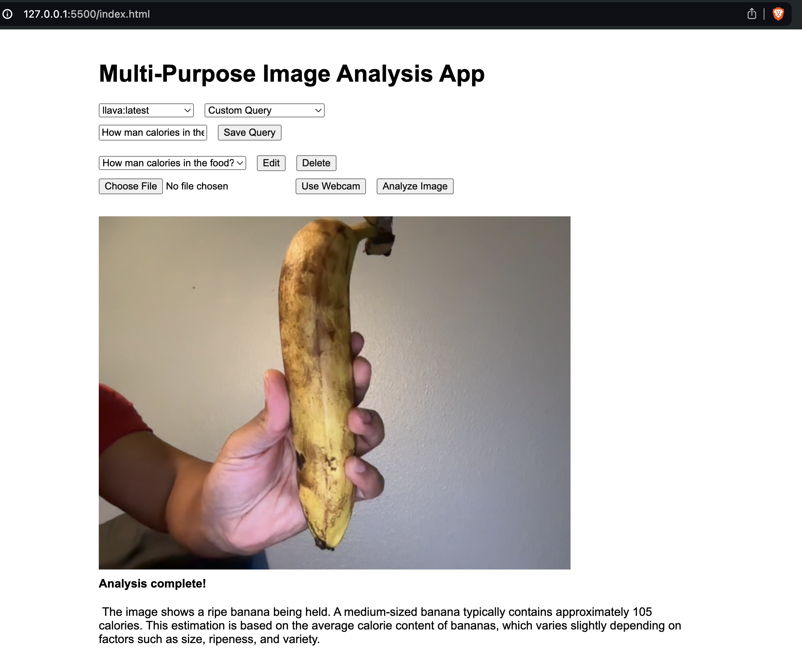

# Multi-Purpose Image Analysis App

## Overview

The Multi-Purpose Image Analysis App is a versatile web application that leverages LLaVA (Large Language and Vision Assistant) models to perform various image analysis tasks. This app allows users to upload images or capture them using a webcam, and then analyze these images for a wide range of purposes, from general description to specific detection tasks.

## Features

- **Multiple Analysis Tasks**: Supports various image analysis tasks, including:
  - General Description
  - Object Detection
  - People Counting
  - Face Detection
  - Text Recognition (OCR)
  - Animal Identification
  - Landmark Recognition
  - Color Analysis
  - Brand/Logo Detection
  - Emotion Recognition
  - Food Detection
  - Vehicle Identification
  - Custom Queries

- **LLaVA Model Integration**: Automatically detects and lists available LLaVA models from your Ollama installation.

- **Image Input Options**:
  - File Upload: Select images from your device.
  - Webcam Capture: Take pictures in real-time using your device's camera.

- **Custom Query Management**:
  - Save custom analysis queries for future use.
  - Edit and delete saved queries.

- **User-Friendly Interface**: Clean and intuitive design for easy navigation and use.

## Prerequisites

- A web server to host the application (e.g., Apache, Nginx).
- [Ollama](https://ollama.ai/) installed on your system.
- At least one LLaVA model installed in Ollama.

## Installation

1. Clone this repository to your local machine or download the HTML file.
2. Place the HTML file in your web server's appropriate directory.
3. Ensure Ollama is running on your system with at least one LLaVA model installed.

## Usage

1. Open the application in a web browser.
2. Select a LLaVA model from the dropdown menu.
3. Choose an analysis task or enter a custom query.
4. Upload an image file or capture one using the webcam.
5. Click the "Analyze Image" button to process the image.
6. View the analysis results displayed on the page.

## Custom Queries

- To use a custom query, select "Custom Query" from the task dropdown.
- Enter your query in the text input field.
- Optionally, save your query for future use by clicking the "Save Query" button.
- Manage saved queries using the dropdown menu and edit/delete buttons.

## Technical Details

- The application is built using HTML, CSS, and JavaScript.
- It communicates with the Ollama API running locally on port 11434.
- Image processing is done client-side, converting images to base64 format before sending to the API.

## Limitations

- The application requires Ollama to be installed and running on the same machine.
- Performance may vary depending on the chosen LLaVA model and the complexity of the analysis task.

## Contributing

Contributions to improve the Multi-Purpose Image Analysis App are welcome. Please feel free to submit issues or pull requests to the repository.

## License

This project is licensed under the MIT License

```
MIT License

Copyright (c) 2024 Jerome Scott

Permission is hereby granted, free of charge, to any person obtaining a copy
of this software and associated documentation files (the "Software"), to deal
in the Software without restriction, including without limitation the rights
to use, copy, modify, merge, publish, distribute, sublicense, and/or sell
copies of the Software, and to permit persons to whom the Software is
furnished to do so, subject to the following conditions:

The above copyright notice and this permission notice shall be included in all
copies or substantial portions of the Software.

THE SOFTWARE IS PROVIDED "AS IS", WITHOUT WARRANTY OF ANY KIND, EXPRESS OR
IMPLIED, INCLUDING BUT NOT LIMITED TO THE WARRANTIES OF MERCHANTABILITY,
FITNESS FOR A PARTICULAR PURPOSE AND NONINFRINGEMENT. IN NO EVENT SHALL THE
AUTHORS OR COPYRIGHT HOLDERS BE LIABLE FOR ANY CLAIM, DAMAGES OR OTHER
LIABILITY, WHETHER IN AN ACTION OF CONTRACT, TORT OR OTHERWISE, ARISING FROM,
OUT OF OR IN CONNECTION WITH THE SOFTWARE OR THE USE OR OTHER DEALINGS IN THE
SOFTWARE.
```

## Acknowledgements

- This application uses the Ollama API and LLaVA models.
- Thanks to the open-source community for inspiration and resources.

## Screenshot
